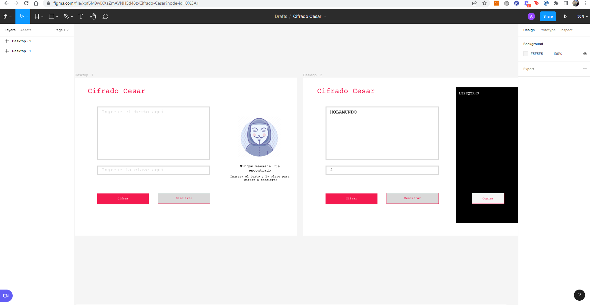

<h1 align="center"> CipherText </h1>

 

## Índice

* [Descripción del proyecto](#descripción-del-proyecto)

* [Investigación UX](#investigación-UX)

* [Características de la aplicación y demostración](#Características-de-la-aplicación-y-demostración)

* [Acceso al proyecto](#acceso-al-proyecto)

* [Tecnologías utilizadas](#tecnologías-utilizadas)

* [Personas-Desarrolladores del Proyecto](#personas-desarrolladores)

## Descripción del proyecto

CipherText es un aplicación para cifrado de mensajería. 

## Investigación UX

Los usuarios de la aplicación son personas que requieran comunicarse de manera segura utilizando una clave en común.

### :black_nib: Prototipo

## Características de la aplicación y demostración

### :hammer:Funcionalidades del proyecto

- `Funcionalidad 1`: Convertir un mensaje a su versión cifrada
- `Funcionalidad 2`: Convertir un mensaje a su versión descifrada

### :star:Aplicación

## Acceso al proyecto

### :checkered_flag:Abre y ejecuta el proyecto

Acceder online mediante el siguiente link : https://abelen21.github.io/LIM018-cipher/

## Tecnologías utilizadas

- HTML
- CSS
- JavaScript

## Personas-Desarrolladores

| [ Belén Arroyo Ramírez](https://github.com/Abelen21) |  
| :---: |

